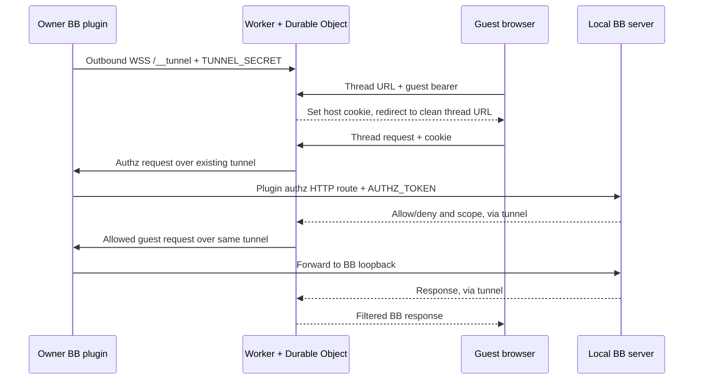

# Sharing architecture review and proposed 1.0 direction

Reviewed 2026-09-08. This is a proposal based on the current checkout, Cloudflare documentation, and targeted executable checks. No runtime behavior was changed. We have not captured an affected recipient's failing request, so the findings below establish possible failure paths, not the cause of every reported failure.

## Recommendation

Keep the outbound WebSocket tunnel, thread share popover, and multiple revocable audience links. Separate endpoint configuration from access grants. Make BB the enforcement boundary and reduce the Worker to a stable relay. Treat temporary deployment as an onboarding convenience, independent of whether an endpoint currently works.

The owner should think: “This hostname connects to my BB. These links grant access to these threads.” Claiming, account ownership, and deployment history are secondary information, not prerequisites for reconnecting.

Do not make one Worker deployment per audience the default. It adds provisioning, expiry, and claim work without fixing the underlying authorization or compatibility problems. One hostname can support many links.

## What Cloudflare actually guarantees

[Cloudflare's claim-deployments documentation](https://developers.cloudflare.com/workers/platform/claim-deployments/) says:

- Temporary accounts support Workers and Durable Objects and can be provisioned before authentication.
- The user must complete the claim within 60 minutes; merely opening the claim URL is insufficient.
- If the claim is not completed, Cloudflare deletes the account and its resources.
- Claiming preserves the Worker and supported resources in the claimed account.
- Claiming does not give the provisioning platform permanent account access. Future deployments require a separate authenticated flow.

The documentation reviewed does not describe a claim-completion callback for this integration. BB should not infer ownership from reachability or from the claim deadline. A past deadline means the onboarding window ended, not proof that a saved endpoint was deleted. Store any owner confirmation as an assertion, not verified Cloudflare state.

Expiry and availability are separate concerns. A healthy claimed endpoint can be kept indefinitely without BB managing the account, but the present plugin cannot update its deployed Worker policy just by updating the local plugin. Renaming, moving, or redeploying resources can require updating the endpoint and its credentials in BB. A dead old hostname cannot redirect previously distributed URLs.

## Current request flow



The local implementation is in [shared-tunnel.ts](../plugin/lib/shared-tunnel.ts), with multiplexing in [session.ts](../packages/bb-shared-tunnel-client/src/session.ts). The edge uses a single [TunnelDO](../worker/src/tunnel/tunnel-do.ts) per deployment. A new tunnel connection replaces the previous one.

This is a custom WebSocket tunnel, not `cloudflared`. It uses the same useful network direction: the local machine initiates an outbound connection, then traffic travels both ways. Cloudflare describes that principle in its [Tunnel documentation](https://developers.cloudflare.com/cloudflare-one/networks/connectors/cloudflare-tunnel/). NAT and CGNAT normally require no inbound port opening with this design; outbound network restrictions and disconnections still need handling.

### Can any Worker announce itself to BB?

Not from nowhere behind NAT. BB must first know where to open the outbound connection, or both sides must connect to a separate, known rendezvous service. A credential authenticates a peer; it does not discover a network route to the machine.

The simple approach is owner registration: deploy automatically or enter an existing HTTPS origin and pairing credential, then BB connects. Once connected, the protocol can exchange identity, version, capabilities, and status. An advertised hostname is metadata, not sufficient authority to change the saved origin, receive secrets, or acquire grants. Explicitly registered aliases need validation too.

Adding a central rendezvous service could enable discovery, but creates another availability dependency and is unnecessary for the requested product.

## Findings

### 1. “Not found” conflates access denial with broken infrastructure

[authz.ts](../worker/src/stages/authz.ts) converts an internal authorization exception, non-2xx response other than 503, or invalid JSON into the same HTML 404 as a denied grant. [guest-error-page.ts](../worker/src/guest-error-page.ts) tells the guest the thread is no longer available and to ask for another link.

Executable check: a valid-looking guest request whose internal authz call returns 401 produces that 404 page. This does not establish that the saved `AUTHZ_TOKEN` is wrong on affected machines; it establishes that such a fault would be hidden. The code itself documents a previous credential-header mismatch that caused this symptom.

Separate invalid/revoked links from owner offline, relay unavailable, pairing failure, incompatible protocol, and local authorization failure. Preserve deny-by-default behavior. Give the owner a diagnostic reason and correlation ID without exposing credentials or internal thread details to guests. A Cloudflare-generated 404 must also be distinguished from BB's own page.

### 2. “Live” does not mean guests can use the link

[worker-lifecycle.ts](../plugin/worker-lifecycle/worker-lifecycle.ts) sets `healthy` from `state === "live"`. Bootstrap and polling mark the Worker live when `/` returns `401 { error: "token_missing" }`; that request never traverses the tunnel or authorizes a guest. Provisioning also marks it live immediately after starting the asynchronous tunnel connection. Reconnecting does not clear live state.

[cf-deploy.ts](../plugin/worker-lifecycle/cf-deploy.ts) additionally returns a deployed URL even after propagation probes run out, and considers almost any non-404 response below 500 sufficient propagation evidence.

Use a readiness sequence: registered → connecting → authenticated → compatible → local gateway reachable → ready. A heartbeat detects a lost connection; a bounded end-to-end probe establishes guest-path readiness. Initial creation should wait for readiness or present a retryable setup state. Existing URLs can remain copyable while offline, with an honest status; never generate a placeholder hostname as a usable URL.

### 3. Multiple audience links share one mutable browser credential

[set-cookie-redirect.ts](../worker/src/stages/set-cookie-redirect.ts) stores the latest guest bearer in `bb_shared_session`, scoped to `/` on the hostname. Clean BB URLs contain no per-tab credential.

Executable check: opening A, then B on the same hostname replaces A's cookie. Requests from A's existing tab now carry B. If B lacks A's thread, authorization denies access. This is a direct explanation for links that seem to stop working after another link is opened. It is not a first-visit explanation for every recipient.

Keep multiple links, but specify session semantics. Recommended for the existing full BB interface: redeem links into an opaque browser session whose access is the union of the still-valid links redeemed in that session. Store references to grants, not permanently copied permissions, and recompute on changes. Opening B then preserves A; revoking A removes only A's contribution. A session with overlapping read/write grants receives the strongest currently held permission. Display that combined-access behavior clearly and provide a way to clear the session.

This is an explicit product change, not a silent patch. Strict per-link/per-tab isolation instead needs a session-aware frontend request context (including WebSockets), or distinct origins; a single root cookie cannot provide it. Concurrent redemption, cookie expiry, reload, and revocation need integration tests.

### 4. Legacy token-in-path links are incomplete entry points

[token.ts](../worker/src/token.ts) still accepts a path bearer, but only the query entry establishes a cookie. Executable check: a path entry continues without setting a cookie, and a fresh browser's subsequent absolute asset request has no credential. The BB router also sees the token-prefixed address even though the upstream request path was stripped.

Current [buildShareUrl](../plugin/lib/token-store.ts) emits the query form, so this affects legacy/manual URLs rather than all current generated links. Normalize all supported entry forms through one validated redemption and clean redirect flow. After redemption, copying the clean address bar URL currently omits the guest credential; the UI should make “Copy invitation” distinguishable from copying a navigation URL.

### 5. Custom hostnames need deliberate origin handling

The Worker derives public origin from each incoming request. The local [header rewrite](../packages/bb-shared-tunnel-client/src/headers.ts) rewrites Origin only when it exactly matches the configured Worker origin.

Executable check: a request through a custom domain preserves that domain's Origin when BB connected using the original `workers.dev` hostname. That can trigger BB's origin guard; a live guard rejection was not exercised in this review. Adding a domain in Cloudflare alone is therefore insufficient for reliable operation under the current contract.

For 1.0, one canonical origin per endpoint is the simplest supported configuration. Changing it requires explicit validation and a readiness check. If supporting aliases, keep a verified alias set attached to one relay identity. Do not open a separate tunnel per alias to the same Durable Object: they would repeatedly replace each other.

### 6. Policy lives in the hardest component to update

The Worker enforces route denial, filters HTTP response bodies, filters WebSocket messages, and injects the guest chrome shim. The plugin computes authorization, but [shared-tunnel.ts](../plugin/lib/shared-tunnel.ts) resolves every incoming stream to the normal BB loopback server without independently applying guest scope.

Consequences:

- Updating local BB or the plugin can leave a claimed Worker with old API assumptions and policy.
- A modified relay holding its connection credential is currently trusted to enforce restrictions before forwarding requests to the local BB server.
- Existing path families include broad reads of thread/project subpaths and plugin/host subpaths; some response filters pass unknown fields through. Future BB routes or fields require review, not an assumption of safety.
- The local client sends a transport protocol version, but the Worker accept path does not validate that parameter. Successful connection is not proof of compatibility.

Move guest authorization, route/method validation, response shaping, and realtime scope enforcement to a local guest gateway. All relay traffic must pass through that gateway; there must be no fallback to the unrestricted owner loopback. The existing vendored tunnel client therefore needs an adapter or a separate restricted local listener rather than continuing to resolve every stream to the owner server.

The relay will still terminate public TLS and see shared content and guest credentials. Local enforcement limits it to valid guest capabilities; it does not make an untrusted relay unable to observe or misuse the guest access it receives.

### 7. Revocation does not refresh an existing WebSocket's scope

[ws-frame-filter.ts](../worker/src/stages/ws-frame-filter.ts) closes over the scope resolved at upgrade. There is no grant-change subscription or periodic reauthorization in that bridge. Revocation affects subsequent HTTP authorization but an open socket can continue receiving previously allowed change notifications until it disconnects.

Make grant removal or revocation update or close affected sessions immediately. Test sockets already open at the time of revocation, not only new connections. This finding concerns the currently forwarded notification frames; it does not imply every transcript request bypasses revocation.

### 8. Installation and link state need a clearer contract

Worker source and Wrangler are found and bundled at first share using a sibling directory and `npx`. That relies on a repository-shaped installation and external tooling at runtime. Ship the prebuilt relay artifact with the plugin and version it explicitly.

The token/grant model has no endpoint ID. URLs are rebuilt against whichever single Worker is current. Recreate disconnects the previous Worker; already-sent URLs remain old while newly copied URLs change. Model this explicitly before adding multiple endpoints. Preserve grants during migration and explain when invitations must be redistributed.

Some comments still describe removed behavior: token-prefixed redirects, swallowed deployment errors, and placeholder integration work. These contradictions make changes harder to reason about and should be removed alongside the relevant refactor.

## Proposed model and user experience

Use two durable concepts:

| Concept | Responsibility |
| --- | --- |
| Endpoint | Stable local ID, canonical HTTPS origin, pairing credential, relay identity/version, observed connection state; optional temporary-deployment/claim metadata |
| Invitation | Bearer credential, endpoint ID, optional audience label, thread grants, revocation state |

Browser sessions reference invitations redeemed on that endpoint. Endpoint membership comes from trusted local connection context, not an arbitrary forwarded Host header. A pairing credential permits relay connection; a guest invitation permits scoped access. Do not combine these authorities or use a public hostname as an access credential. The generic BB plugin token should no longer need to be stored at the edge once authorization moves local.

The thread popover remains the main workflow:

```text
Share this thread
share.example.com · Connected

Design team      Off / Read / Write     Copy invitation
Client          Off / Read / Write     Copy invitation

New invitation
Manage connections
```

Audience labels describe how the owner intends to distribute a bearer link; they do not authenticate a person's identity. Default to a ready endpoint, show its hostname, and hide endpoint selection when only one exists. Keep hostname setup, claim notices, reconnect, replace, and removal in connection management. Add multiple endpoint selection when needed without forcing every owner to manage deployments per audience.

Creating a temporary endpoint is still one useful first-use action. Registering an already deployed compatible relay is the other. A claim action simply opens Cloudflare; it does not change the tunnel's health. Removing an endpoint locally disconnects it and revokes its local authority; it does not promise to delete a claimed Cloudflare deployment.

## Implementation order

1. **Make failures diagnosable.** Introduce distinct failure reasons, owner-visible connection diagnostics, correlation IDs, and end-to-end readiness. Normalize legacy entry links, remove placeholder URLs, and make initial creation recoverable without silently minting duplicate invitations. Capture an actual failing guest session to identify which observed failures are most common.
2. **Introduce the local guest gateway and a versioned relay contract.** Port existing policy and filtering functions to the local boundary, enforce explicit routes and response schemas, remove edge dependence on the generic plugin token, and enforce protocol compatibility. Reuse working multiplexing and heartbeat code. Serve guest chrome through this boundary while planning any supported BB guest-mode integration separately.
3. **Separate endpoints, invitations, and browser sessions.** Migrate the saved Worker into an endpoint and bind existing grants to it. Implement chosen multi-invitation session semantics and immediate realtime revocation. Keep owner storage encrypted. Define reconnect versus replace and intentional grant migration between endpoints.
4. **Simplify onboarding and UI.** Ship the built relay, support deploy or register, expose hostname and readiness in the share popover, make audience labels optional, and put deployment management elsewhere. Support one canonical origin first; aliases require identity-aware handling.
5. **Release only after real end-to-end coverage.** Exercise actual BB, the Workers runtime, clean guest browsers, and an external network. Include a claimed deployment upgrade/reconnection path because that is the lifecycle unit tests cannot establish.

Existing Workers need an explicit migration strategy. The plugin has no retained Cloudflare deployment authority to update a claimed Worker automatically. Offer a user-controlled deployment update or a new endpoint with new invitations. If an old protocol is retained temporarily, show its compatibility limit rather than letting old edge policy silently masquerade as the new gateway guarantees.

## 1.0 acceptance checks

- Fresh installation outside a development checkout can create and open its first invitation.
- A clean recipient browser on another network can read the intended thread, receive live updates, and send only when granted write access.
- Private threads, owner RPCs, terminals, unknown API routes, and out-of-scope response fields remain inaccessible through the local gateway, including crafted relay requests.
- Opening A and B on one origin behaves according to the documented session model across tabs, reloads, and concurrent requests.
- Removing a grant or revoking a link affects open sockets as well as subsequent HTTP requests.
- Restart, sleep/wake, network loss, and relay reconnect preserve existing invitations and accurately report readiness.
- Temporary expiry, successful claim, endpoint replacement, and hostname changes have predictable outcomes; no copied URL is silently presented as repaired when its old hostname is gone.
- Registered custom origins work with the local origin guard. Aliases, if supported, do not create competing tunnels to the same relay.
- Old/new Worker and plugin combinations either interoperate under a tested version contract or report a specific incompatibility.
- Diagnostics identify the failing layer without logging bearer URLs, session cookies, pairing credentials, or claim URLs.

## Verification performed in this review

- Worker typecheck passed.
- All 197 existing Worker tests passed across 8 files. These are Node-based pure-function/mocked-socket tests, not a Workers runtime or real BB browser integration suite.
- Four additional ephemeral executable checks reproduced the internal-authz-401-to-404 mapping, missing session cookie for path-bearer entry, cross-link cookie replacement/denial, and custom-origin rewrite mismatch.
- Static inspection established readiness reporting, policy placement, stale socket scope, packaging assumptions, and absent endpoint association.
- No live deployment, account claim, affected-recipient reproduction, full plugin test run, or runtime migration was performed. Runtime source files were left unchanged.
